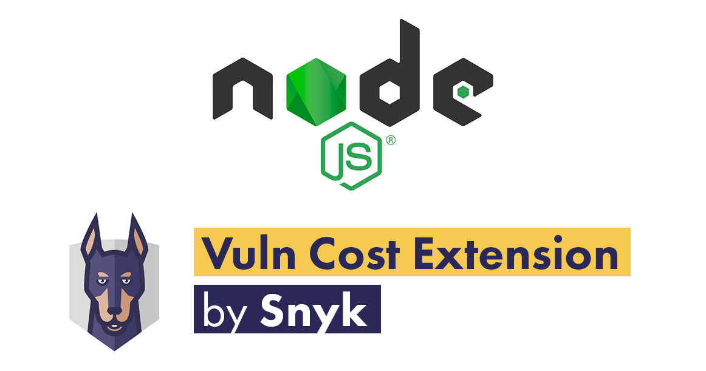

<p align="center">
  
</p>

<h1 align="center">Tutorial NodeJS Snyk Vuln Cost</h1>

<p align="center">In this tutorial I want to show you how to use the extension <strong>Vuln Cost</strong> for <strong>VSCode</strong> and quickly visualize which of the dependencies of your projects are vulnerable.</p>

<p align="center">
  <a title="MIT License" href="LICENSE.md">
    
  </a>
  <a title="Twitter: JoseJ_PR" href="https://twitter.com/JoseJ_PR">
    
  </a>  
  <a title="Github: Sponsors" href="https://github.com/sponsors/JoseJPR">
    
  </a>
  <br />
  <br />
</p>

## 🔖 Description

First of all I leave you a list of the main features of the extensión **Vuln Cost** and **Snyk**, the company that has developed and published it as **OpenSource**.

### Vuln Cost: Security Scanner for VS Code

An Open Source security scanner for VS Code. Detect vulnerabilities in third-party open source packages automatically while you code..

* **Find security vulnerabilities in the npm packages you import** \
  See the number of known vulnerabilities in your imported npm packages as soon as you require them!.
* **See your project vulnerabilities inline, as you code** \
  See feedback directly in your editor. Vuln Cost displays the number of vulnerabilities your packages add to your project.
* **Find security vulnerabilities in your JavaScript packages from well-known CDNs** \
  Vuln Cost scans any HTML files in your projects and displays vulnerability information about the JavaScript packages you download from your favorite CDN.
* **See in-depth information about your vulnerabilities** \
  Access relevant resources that will give you deeper information about the vulnerabilities that directly affect your project.

Homepage: [Snyk | Vuln Cost](https://snyk.io/security-scanner-vuln-cost/) \
VSCode Extension: [Visual Studio Code | Vuln Cost](https://marketplace.visualstudio.com/items?itemName=snyk-security.vscode-vuln-cost)

### Snyk: helps you use open source and stay secure

Snyk empowers software-driven businesses to develop fast and stay secure.

Snyk’s unique combination of developer-first tooling and best in class security depth enables businesses to easily build security into their continuous development process.

* **Developer-first security** \
  Giving developers a security tool they use and love.
* **Automated remediation** \
  Powerful fix advice and automation that enables security at scale and speed.
* **Leading vulnerability database** \
  Hand-curated, enriched and first to publish vulnerability content.

Website Company: [Snyk](https://snyk.io/)

## ✅ Prerequisites

In order to work with this project, your local environment must have at least the following versions:

* NodeJS Version: 13.xx
* NPM Version: 6.12.0

## 📐 How to work with this project in your VSCode Editor

First of all, you need to have the extension **Vuln Cost** installed in **VSCode** or **Gitpod** before open the examples. You can then check which modules contain vulnerability.

In this tutorial you can see that we have these dependencies in the "package.json" file:

```json
"dependencies": {
  "express": "4.14.0",
  "jsonwebtoken": "7.2.0",
  "moment": "2.16.0"
}
```

If we update them by these others or higher versions, the vulnerabilities will disappear:

```json
"dependencies": {
  "express": "4.17.1",
  "jsonwebtoken": "8.5.1",
  "moment": "2.24.0"
}
```

### 📹 Demos with VSCode

The following video shows how you can install this extension on your VSCode.
[](https://youtu.be/1_ptjvhxH1s)

The require of JavaScript libraries and how to check vulnerabilities.
[](https://youtu.be/gfi0WC6j8Qk)

The import of JavaScript libraries and how to check vulnerabilities.
[](https://youtu.be/wI4PF-BuM-g)

## ⛅️ How to work with this project in Gitpod

You can run this project in Gitpod, a one-click online IDE for GitHub:

[](https://gitpod.io/#https://github.com/JoseJPR/tutorial-nodejs-snyk-vuln-cost)

### 📹 Demo with Gitpod

The following video shows how you can install this extension on Gitpod.
[](https://youtu.be/XXXXXXXX)

## 📂 Code Scaffolding

```any
/
├── assets 🌈                   # Images Sources.
├── src 📦                      # All Apps with demos.
|   ├── example-custom-library  # WIP...
|   ├── example-import          # Using import for add npm module.
|   ├── example-require         # Using require for add npm module.
|   └── ...
└── ...
```

## ⛽️ Review and Update Sependencies

For review and update all npm dependencies of this project you need install in global npm package "npm-check-updates" npm module.

```bash
# Install and Run
$npm i -g npm-check-updates
$ncu
```

## License

[MIT](LICENSE.md)

## Happy Code

Created with JavaScript, lot of ❤️ and a few ☕️

## This README.md file has been written keeping in mind

[GitHub Markdown](https://guides.github.com/features/mastering-markdown/) \
[Emoji Cheat Sheet](https://www.webfx.com/tools/emoji-cheat-sheet/)
